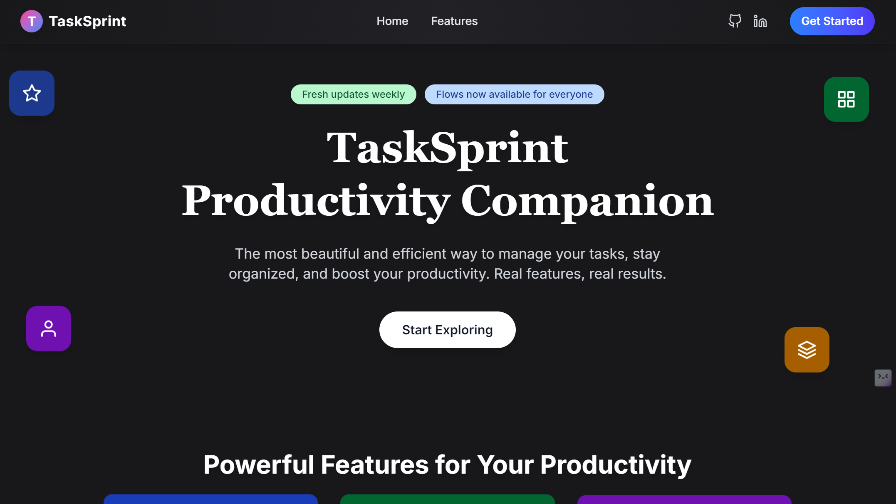
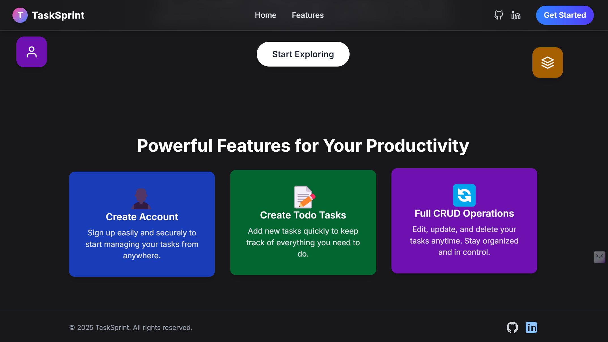
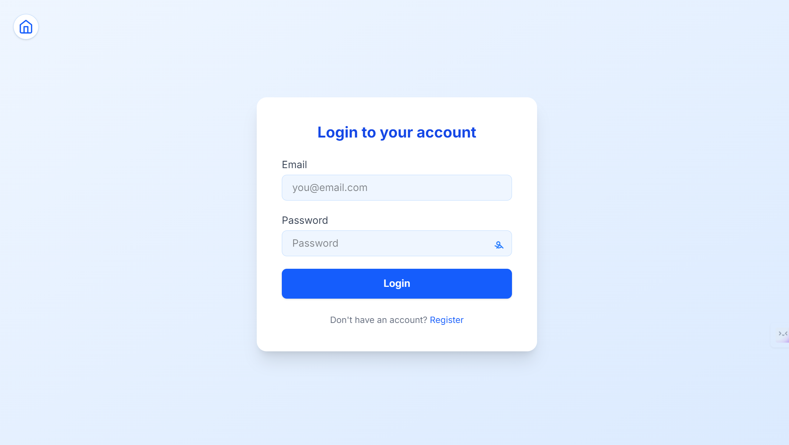
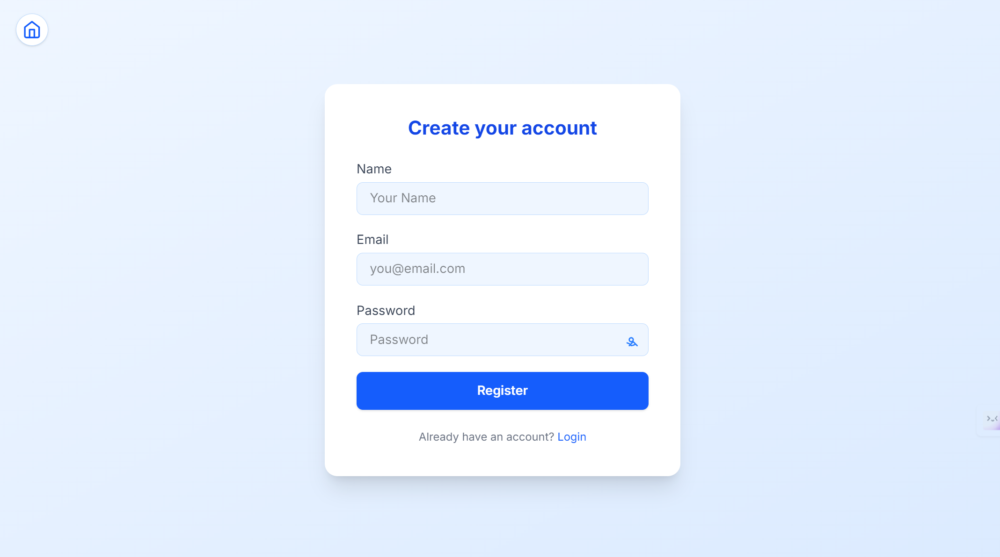
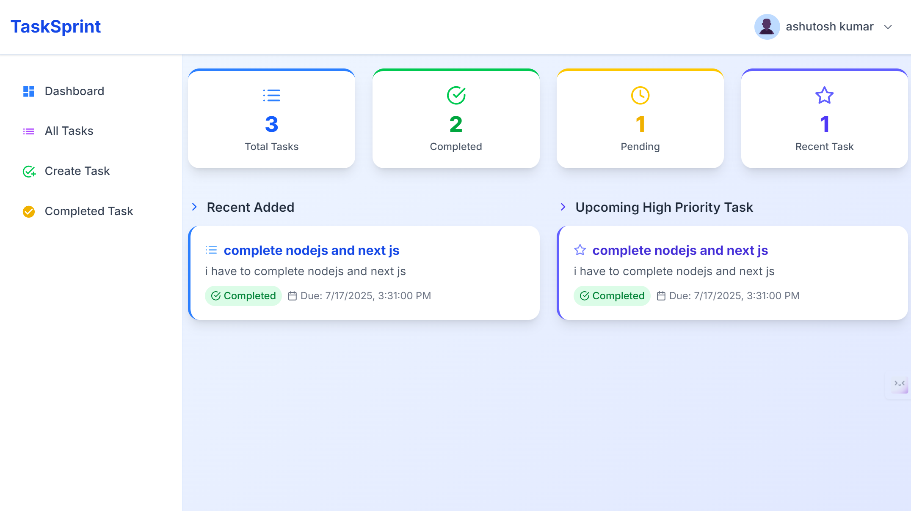
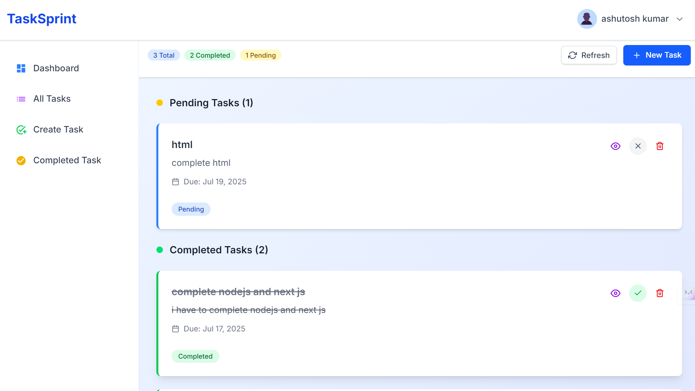
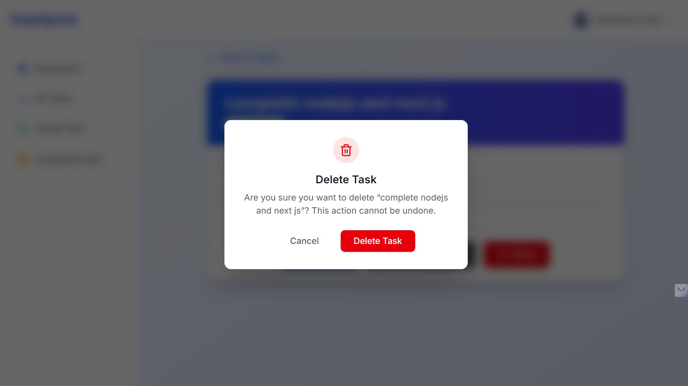
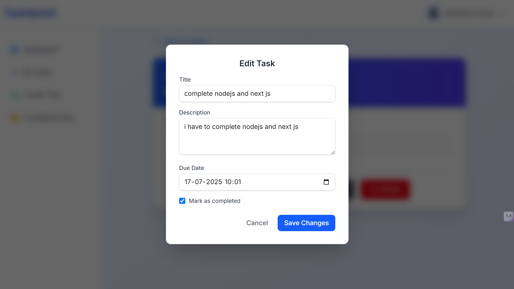
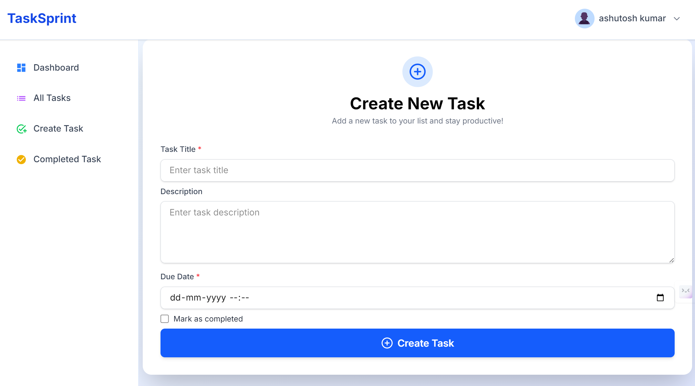
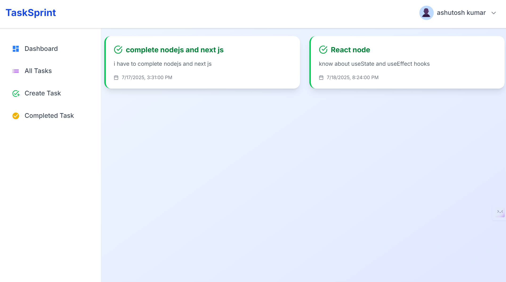

# TaskSprint

A modern, fullstack productivity and task management app designed to help you organize, track, and complete your tasks efficiently.

## 📁 Folder Structure

```
tasksprint/
  ├── backend/
  ├── frontend/
  └── requirements/
```

## 🚀 Getting Started

1. Clone the repository
2. Install dependencies for both backend and frontend
3. Run backend and frontend servers

## 🤝 Developer Contribution

- **Ashutosh Kumar**
  - [GitHub](https://github.com/ashukr321)
  - [Portfolio](https://www.devashu.tech/)

## 📄 Project Requirement

The detailed project requirement is available in the following PDF:

- [Download Requirement PDF](requirements/1._to-do_list_api.pdf)
- [Preview Requirement PDF](requirements/1._to-do_list_api.pdf)

---

## 🚀 Future Enhancements for TaskSprint

| **Feature**                      | **Description**                                      | **New DB Fields / Models**                                                                                     | **API Endpoints**                                               | **Frontend Ideas**                                |
| -------------------------------- | ---------------------------------------------------- | -------------------------------------------------------------------------------------------------------------- | --------------------------------------------------------------- | ------------------------------------------------- |
| **Leaderboard (Monthly/Yearly)** | Rank users by tasks completed and productivity score | - Use `Task` aggregation or create `TaskStats` model<br>- Fields: `userId`, `month`, `completedTasks`, `score` | `GET /api/leaderboard/monthly`<br>`GET /api/leaderboard/yearly` | Table of top 10 users, filters for global/friends |
| **Progress Tracker**             | Visualize monthly and yearly progress                | New model `ProgressTracker`<br>Fields: `userId`, `month`, `year`, `completedTasks`, `streak`, `completionRate` | `GET /api/progress/monthly`<br>`GET /api/progress/yearly`       | Line & bar charts, best/worst months              |
| **Public Profile Sharing**       | Share productivity profile with others via URL       | Extend `User` schema:<br>→ `username` (unique)<br>→ `publicProfile` (boolean)                                  | `GET /api/users/:username/public-profile`                       | Shareable link showing stats, streaks, rank       |
| **Gamification (Badges/XPs)**    | Reward users for consistency & productivity          | Extend `User` schema:<br>→ `xpPoints`, `badges`, `coins`, `streak`                                             | `GET /api/user/rewards`                                         | Badge icons, XP bar, unlockable themes            |
| **Goals & Reminders**            | Set monthly/weekly task goals and receive reminders  | Add to `User` schema:<br>→ `goals.monthly`, `goals.weekly`<br>Use cron/email system for reminders              | `POST /api/user/goals`<br>`GET /api/user/goals`                 | Progress ring UI, reminder popups                 |

---

## 📸 Screenshots

Below are some screenshots of TaskSprint in action:














